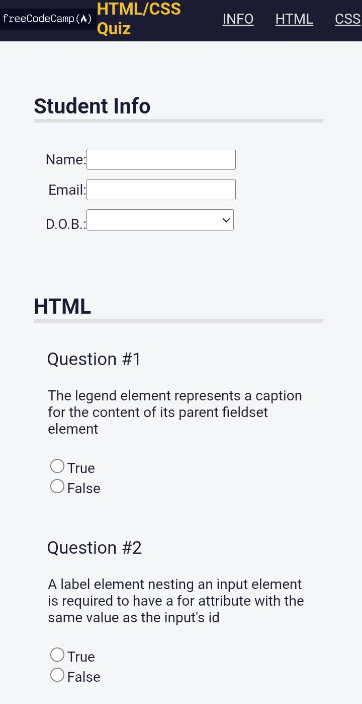

# 🧠 Cuestionario FCC


Aplicación web interactiva de cuestionario que permite responder preguntas y obtener resultados de forma dinámica.

---

## 🚀 Demo

🔗 **Probar la aplicación**

[](https://carlosdm121.github.io/cuestionariofcc/)

---

## 🖼 Vista del proyecto



---

## 🛠 Tecnologías utilizadas

<p>

</p>

- HTML5
- CSS3
- JavaScript

---

## 📂 Características

✔ Sistema de preguntas con opciones  
✔ Selección de respuestas  
✔ Evaluación automática  
✔ Interfaz simple y rápida  
✔ Aplicación web ligera sin frameworks

---

## 📦 Instalación

1. Clonar el repositorio

```bash
git clone https://github.com/carlosdm121/cuestionariofcc.git
```

2. Entrar a la carpeta

```
cd cuestionariofcc
```

3. Abrir el archivo

```
index.html
```

---

## 👨‍💻 Autor

Proyecto desarrollado por **Carlos Daniel Martínez**

🔗 GitHub  
https://github.com/carlosdm121
